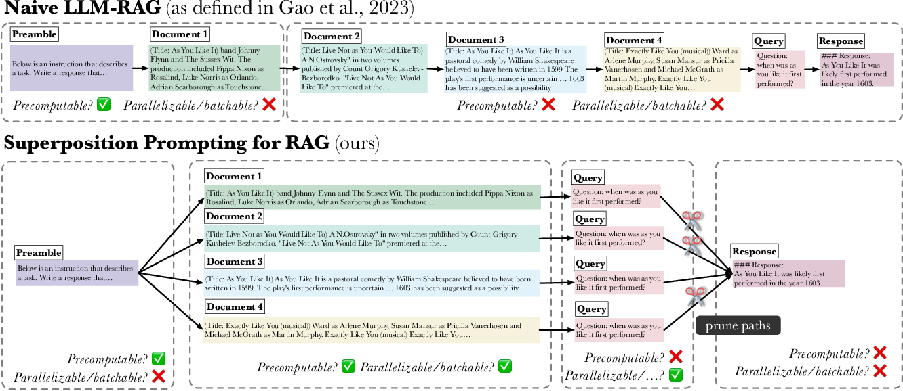

# [ICML 2024] Superposition Prompting



#### Links

* [Arxiv](https://arxiv.org/abs/2404.06910)
* [Semantic Scholar](https://www.semanticscholar.org/paper/Superposition-Prompting%3A-Improving-and-Accelerating-Merth-Fu/9c45b4af25e192733d42a8d384e41002786d0d32)


## Overview

This repository contains an implementation of the Superposition Prompting methodology outlined in ICML 2024 paper of the same name. In conjunction with the underlying prompting implementation, we also present configuration/orchestration code to replicate the experimental results presented in the paper.


## Repository Setup

*Note: all scripts are meant to be run from the root directory of this project.*

1. In the root directory, run `bash setup.sh`.
2. Run `conda activate sp-env`.


##### Setup for Lost in the Middle (NaturalQuestions-Open)

1. Run `bash flows/lost_in_the_middle/setup.sh`.
2. Kick off an evaluation flow using `poetry run python flows/lost_in_the_middle/main.py -c <CONFIG FILE FROM flows/lost_in_the_middle/configs>`.


##### Setup for MuSiQue

1. Run `bash flows/musique/setup.sh`.
2. Kick off an evaluation flow using `poetry run python flows/musique/main.py -c <CONFIG FILE FROM flows/musique/configs>`.


### Running Evaluation Flow

See the `example_run.sh` file in each of the subdirectories of the `flows` directory.


## Acknowledgements

* We would like to acknowledge Nelson Liu's [lost-in-the-middle](https://github.com/nelson-liu/lost-in-the-middle) repository, in which much of the structure of this codebase is rooted.


If you found our work useful or relevant to your own, please consider citing our work:

```
@inproceedings{merth2024superposition,
      title={Superposition Prompting: Improving and Accelerating Retrieval-Augmented Generation}, 
      author={Thomas Merth and Qichen Fu and Mohammad Rastegari and Mahyar Najibi},
      year={2024},
      booktitle={International Conference on Machine Learning}
}
```
